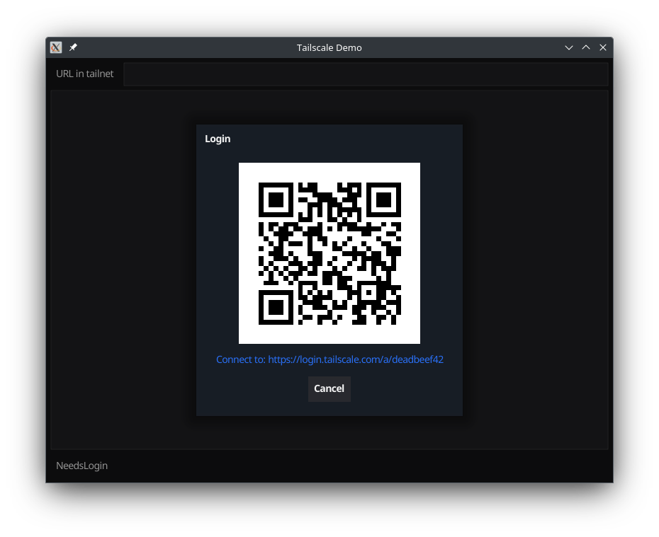

# fynetailscale

A set of widgets to make it easier to write Fyne application that connect to a tailscale network

## Login

To automatically display a QRCode and HyperLink pointing to the tailscale authentication service when joining a tailscale network, you can use the following helper:

```go
func NewLogin(ctx context.Context, win fyne.Window, lc *tailscale.LocalClient, done func(succeeded bool)) io.Closer
```

This helper will display a dialog with an infinite progress bar until tailscale indicate that the user should login by following an URL to tailscale. This URL will be displayed in the form of a QR code and an hyperlink. This give the possibility to easily use a different device to log in and never type a password on the machine joining the tailscale network. Clicking on the hyperlink will use the default browser of the machine the fyne application is running on to authenticate to tailscale.

## Status

This provide the ability to monitor the connection to the tailscale network and display it in a Fyne widget.Label.

```go
func NewStatus(ctx context.Context, lc *tailscale.LocalClient) *widget.Label
```

It is possible to get a String data binding that you can use how you want to get the tailscale connection status.

```go
func NewStatusBinding(ctx context.Context, lc *tailscale.LocalClient) binding.String
```

## QR code

This helper are here to facilitate displaying an URL in the form of a QRCode along with a Fyne widget.Hyperlink.

```go
func NewQRCode(u *url.URL) (*QRCode, error)

func (r *QRCode) SetURL(url *url.URL) error
```

## Example

For a demo, you can install the provided application that allow you to do HTTP Get inside your tailscale network with the following command:
```
$ go install github.com/fyne-labs/fynetailscale/cmd/demo@latest
```


